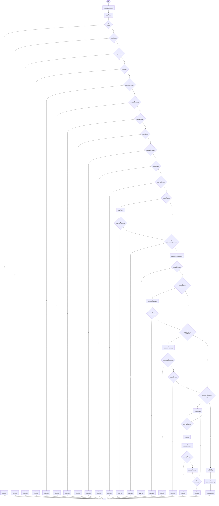

# Biểu đồ điều khiển - PUT /api/products/:id (Dòng 166-287)

## Code với đánh số nguyên liên tục (1-64)

**Chú thích:** Tất cả các node và return statements được đánh số nguyên liên tục từ 1-64

```
[1] const {
      name, description, price, countOfPage, countInStock,
      category, author, images, publishedAt,
    } = req.body;
[2] const product = await Product.findById(req.params.id);

[3] if (!product) {
[4]   return res.status(404).json({ message: "Không tìm thấy sản phẩm" });
    }

[5] if (name !== undefined && (!name || (typeof name === 'string' && name.trim() === ""))) {
[6]   return res.status(400).json({ message: 'Vui lòng nhập đầy đủ thông tin' });
    }
[7] if (description !== undefined && (!description || (typeof description === 'string' && description.trim() === ""))) {
[8]   return res.status(400).json({ message: 'Vui lòng nhập đầy đủ thông tin' });
    }
[9] if (price !== undefined && (price === "" || price === null || price === undefined)) {
[10]   return res.status(400).json({ message: 'Vui lòng nhập đầy đủ thông tin' });
    }
[11] if (countOfPage !== undefined && (countOfPage === "" || countOfPage === null || countOfPage === undefined)) {
[12]   return res.status(400).json({ message: 'Vui lòng nhập đầy đủ thông tin' });
    }
[13] if (countInStock !== undefined && (countInStock === "" || countInStock === null || countInStock === undefined)) {
[14]   return res.status(400).json({ message: 'Vui lòng nhập đầy đủ thông tin' });
    }
[15] if (category !== undefined && (!category || category === "")) {
[16]   return res.status(400).json({ message: 'Vui lòng nhập đầy đủ thông tin' });
    }
[17] if (author !== undefined && (!author || (typeof author === 'string' && author.trim() === ""))) {
[18]   return res.status(400).json({ message: 'Vui lòng nhập đầy đủ thông tin' });
    }
[19] if (publishedAt !== undefined && (!publishedAt || publishedAt === "")) {
[20]   return res.status(400).json({ message: 'Vui lòng nhập đầy đủ thông tin' });
    }
[21] if (images !== undefined && (!images || !Array.isArray(images) || images.length === 0)) {
[22]   return res.status(400).json({ message: 'Vui lòng nhập đầy đủ thông tin (cần ít nhất 1 ảnh)' });
    }

[23] if (name !== undefined && typeof name === 'string' && name.trim().length > 250) {
[24]   return res.status(400).json({ message: 'Tên sách không được vượt quá 250 ký tự' });
    }

[25] if (typeof author === 'string') {
[26]   const authorTrimmed = author.trim();
[27]   if (authorTrimmed.length < 3|| authorTrimmed.length > 50) {
[28]     return res.status(400).json({ message: 'Tác giả phải có tối thiểu 3 ký tự không được vượt quá 50 ký tự' });
      }
    }

[29] if (description !== undefined && typeof description === 'string' && description.trim().length > 2000) {
[30]   return res.status(400).json({ message: 'Mô tả không được vượt quá 2000 ký tự' });
    }

[31] const priceNum = Number(price);
[32] if (isNaN(priceNum) || priceNum <= 1000 || !Number.isInteger(priceNum)) {
[33]   return res.status(400).json({ message: 'Giá bán tối thiểu là 1.000 VNĐ' });
    }

[34] if (countInStock !== undefined) {
[35]   const stockNum = Number(countInStock);
[36]   if (isNaN(stockNum) || stockNum <= 0 || !Number.isInteger(stockNum)) {
[37]     return res.status(400).json({ message: 'Số lượng tồn kho tối thiểu là 1' });
      }
    }

[38] if (countOfPage !== undefined) {
[39]   const pageNum = Number(countOfPage);
[40]   if (isNaN(pageNum) || pageNum < 0 || !Number.isInteger(pageNum)) {
[41]     return res.status(400).json({ message: 'Giá trị không hợp lệ' });
      }
[42]   else if (pageNum < 24) {
[43]     return res.status(400).json({ message: 'Số trang tối thiểu là 24 trang' });
      }
    }

[44] if (images !== undefined && Array.isArray(images)) {
      const allowedTypes = /jpeg|jpg|png|svg/;
[45]   for (const image of images) {
[46]     if (image && image.url) {
[47]       const urlLower = image.url.toLowerCase();
[48]       const hasValidExtension = allowedTypes.test(urlLower);
[49]       if (!hasValidExtension) {
[50]         return res.status(400).json({ message: 'Hình ảnh phải có định dạng JPG, JPEG, PNG hoặc SVG' });
          }
          
[51]       const isValidSize = await checkImageSize(image.url);
[52]       if (!isValidSize) {
[53]         return res.status(400).json({ message: 'Kích thước hình ảnh không được vượt quá 25MB' });
          }
        }
      }
    }

[54-62] Update product fields (tuần tự)
[54] if (name !== undefined) product.name = name;
[55] if (description !== undefined) product.description = description;
[56] if (price !== undefined) product.price = price;
[57] if (countOfPage !== undefined) product.countOfPage = countOfPage;
[58] if (countInStock !== undefined) product.countInStock = countInStock;
[59] if (category !== undefined) product.category = category;
[60] if (images !== undefined) product.images = images;
[61] if (author !== undefined) product.author = author;
[62] if (publishedAt !== undefined) product.publishedAt = publishedAt;

[63] const updatedProduct = await product.save();
[64] res.status(200).json(updatedProduct);
```

## Mô tả biểu đồ điều khiển dạng text

```
START
  ↓
[1] Destructure req.body
  ↓
[2] Find product by ID
  ↓
[3] if (!product)?
    ├─T→ [4] return 404 → END
    └─F→
        ↓
[5] if (name invalid)?
    ├─T→ [6] return 400 → END
    └─F→
        ↓
[7] if (description invalid)?
    ├─T→ [8] return 400 → END
    └─F→
        ↓
[9] if (price invalid)?
    ├─T→ [10] return 400 → END
    └─F→
        ↓
[11] if (countOfPage invalid)?
    ├─T→ [12] return 400 → END
    └─F→
        ↓
[13] if (countInStock invalid)?
    ├─T→ [14] return 400 → END
    └─F→
        ↓
[15] if (category invalid)?
    ├─T→ [16] return 400 → END
    └─F→
        ↓
[17] if (author invalid)?
    ├─T→ [18] return 400 → END
    └─F→
        ↓
[19] if (publishedAt invalid)?
    ├─T→ [20] return 400 → END
    └─F→
        ↓
[21] if (images invalid)?
    ├─T→ [22] return 400 → END
    └─F→
        ↓
[23] if (name length > 250)?
    ├─T→ [24] return 400 → END
    └─F→
        ↓
[25] if (author is string)?
    ├─T→
    │   ↓
    │   [26] Trim author
    │   ↓
    │   [27] if (author length invalid)?
    │       ├─T→ [28] return 400 → END
    │       └─F→ tiếp tục
    └─F→ tiếp tục
        ↓
[29] if (description length > 2000)?
    ├─T→ [30] return 400 → END
    └─F→
        ↓
[31] priceNum = Number(price)
  ↓
[32] if (priceNum invalid)?
    ├─T→ [33] return 400 → END
    └─F→
        ↓
[34] if (countInStock !== undefined)?
    ├─T→
    │   ↓
    │   [35] stockNum = Number(countInStock)
    │   ↓
    │   [36] if (stockNum invalid)?
    │       ├─T→ [37] return 400 → END
    │       └─F→ tiếp tục
    └─F→ tiếp tục
        ↓
[38] if (countOfPage !== undefined)?
    ├─T→
    │   ↓
    │   [39] pageNum = Number(countOfPage)
    │   ↓
    │   [40] if (pageNum format invalid)?
    │       ├─T→ [41] return 400 → END
    │       └─F→
    │           ↓
    │           [42] if (pageNum < 24)?
    │               ├─T→ [43] return 400 → END
    │               └─F→ tiếp tục
    └─F→ tiếp tục
        ↓
[44] if (images !== undefined && Array.isArray)?
    ├─T→
    │   ↓
    │   [45] for (const image of images)
    │       ↓
    │       [46] if (image && image.url)?
    │           ├─T→
    │           │   ↓
    │           │   [47] urlLower = image.url.toLowerCase()
    │           │   ↓
    │           │   [48] hasValidExtension = test extension
    │           │   ↓
    │           │   [49] if (!hasValidExtension)?
    │           │       ├─T→ [50] return 400 → END
    │           │       └─F→
    │           │           ↓
    │           │           [51] isValidSize = await checkImageSize()
    │           │           ↓
    │           │           [52] if (!isValidSize)?
    │           │               ├─T→ [53] return 400 → END
    │           │               └─F→ tiếp tục vòng lặp
    │           └─F→ tiếp tục vòng lặp
    └─F→ tiếp tục
        ↓
[54-62] Cập nhật các trường product (tuần tự)
  ↓
[63] const updatedProduct = await product.save()
  ↓
[64] res.status(200).json(updatedProduct)
  ↓
END
```

## Biểu đồ điều khiển Mermaid (đánh số nguyên liên tục)




