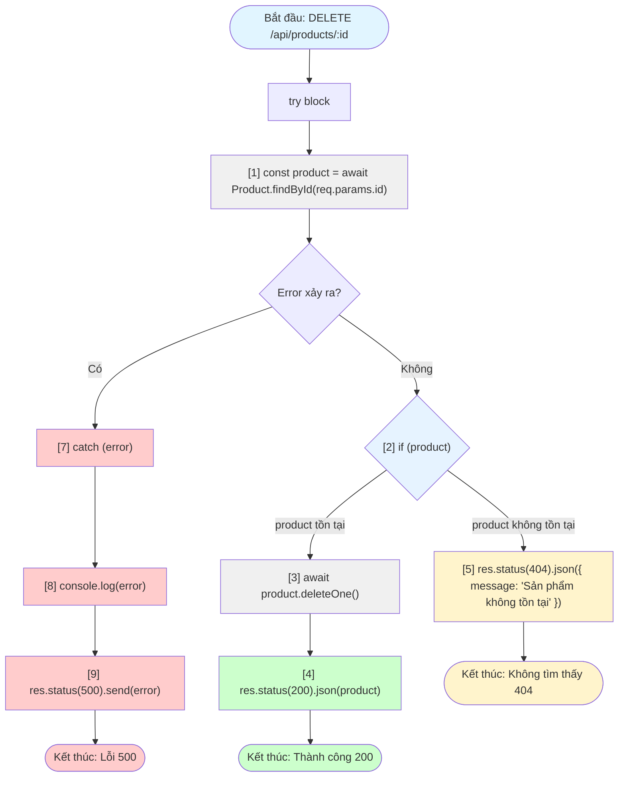

# Biểu đồ luồng điều khiển - Delete Product Route

## Code được đánh số (bắt đầu từ dòng const):

```
[1] const product = await Product.findById(req.params.id);
[2] if (product) {
[3]   await product.deleteOne();
[4]   res.status(200).json(product);
[5] } else {
[6]   res.status(404).json({ message: "Sản phẩm không tồn tại" });
[7] } catch (error) {
[8]   console.log(error);
[9]   res.status(500).send(error);
}
```

## Biểu đồ luồng điều khiển (Mermaid):



## Mô tả luồng điều khiển:

1. **Bắt đầu**: Route handler nhận request DELETE `/api/products/:id`
2. **Bước [1]**: Tìm sản phẩm theo ID từ database
3. **Kiểm tra lỗi**: 
   - Nếu có lỗi → chuyển sang catch block
   - Nếu không có lỗi → tiếp tục kiểm tra product
4. **Bước [2]**: Kiểm tra xem product có tồn tại không
   - **Nếu product tồn tại**:
     - **Bước [3]**: Xóa sản phẩm khỏi database
     - **Bước [4]**: Trả về response 200 với thông tin sản phẩm đã xóa
   - **Nếu product không tồn tại**:
     - **Bước [5]**: Trả về response 404 với thông báo "Sản phẩm không tồn tại"
5. **Xử lý lỗi (catch block)**:
   - **Bước [8]**: Ghi log lỗi ra console
   - **Bước [9]**: Trả về response 500 với thông tin lỗi

## Các trường hợp kết thúc:

- ✅ **200 OK**: Xóa sản phẩm thành công
- ⚠️ **404 Not Found**: Sản phẩm không tồn tại
- ❌ **500 Internal Server Error**: Lỗi server khi thực hiện thao tác


