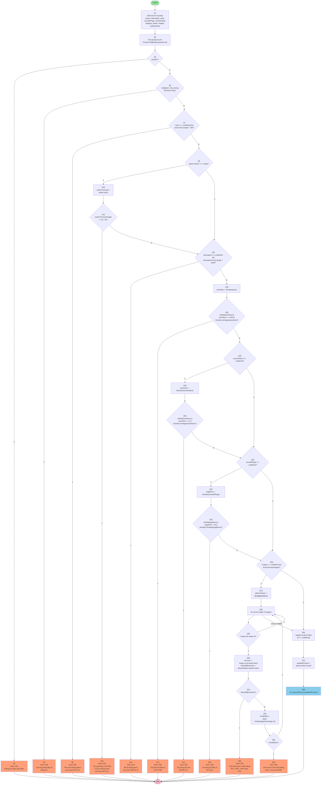

# Biểu đồ dòng điều khiển - PUT /api/products/:id (Update Product)

## Code với đánh số [1]-[38]

Dựa trên đoạn code được đánh số từ [1] đến [38] trong endpoint PUT update product.

## Biểu đồ Mermaid



## Mô tả luồng điều khiển dạng text

```
START
  ↓
[1] Destructure request body: {name, description, price, countOfPage, countInStock, category, author, images, publishedAt}
  ↓
[2] Tìm sản phẩm theo ID: Product.findById(req.params.id)
  ↓
[3] Kiểm tra sản phẩm có tồn tại không (if (!product))
  ├─ T → [4] Return 404: "Không tìm thấy sản phẩm" → END
  └─ F → [5] Kiểm tra các trường bắt buộc trống (validation tổng hợp)
         ├─ T → [6] Return 400: "Vui lòng nhập đầy đủ thông tin" → END
         └─ F → [7] Validation tên sách: độ dài không quá 250 ký tự
                ├─ T → [8] Return 400: "Tên sách không được vượt quá 250 ký tự" → END
                └─ F → [9] Kiểm tra type của author (if (typeof author === 'string'))
                       ├─ T → [10] authorTrimmed = author.trim()
                       │        ↓
                       │        [11] Kiểm tra độ dài author (3-50 ký tự)
                       │        ├─ T → [12] Return 400: "Tác giả phải có tối thiểu 3 ký tự..." → END
                       │        └─ F → [13] Validation mô tả: độ dài không quá 2000 ký tự
                       └─ F → [13] Validation mô tả: độ dài không quá 2000 ký tự
                              ├─ T → [14] Return 400: "Mô tả không được vượt quá 2000 ký tự" → END
                              └─ F → [15] Chuyển đổi price sang số: priceNum = Number(price)
                                     ↓
                                     [16] Validation giá bán: số nguyên, >= 1000
                                     ├─ T → [17] Return 400: "Giá bán tối thiểu là 1.000 VNĐ" → END
                                     └─ F → [18] Kiểm tra countInStock có được cung cấp
                                            ├─ T → [19] stockNum = Number(countInStock)
                                            │        ↓
                                            │        [20] Validation số lượng tồn kho: số nguyên, >= 1
                                            │        ├─ T → [21] Return 400: "Số lượng tồn kho tối thiểu là 1" → END
                                            │        └─ F → [22] Kiểm tra countOfPage có được cung cấp
                                            └─ F → [22] Kiểm tra countOfPage có được cung cấp
                                                   ├─ T → [23] pageNum = Number(countOfPage)
                                                   │        ↓
                                                   │        [24] Validation số trang: số nguyên, >= 24
                                                   │        ├─ T → [25] Return 400: "Số trang tối thiểu là 24 trang" → END
                                                   │        └─ F → [26] Kiểm tra images có được cung cấp và là array
                                                   └─ F → [26] Kiểm tra images có được cung cấp và là array
                                                          ├─ T → [27] allowedTypes = /jpeg|jpg|png|svg/
                                                          │        ↓
                                                          │        [28] Lặp qua từng hình ảnh (for loop)
                                                          │        ↓
                                                          │        [29] Kiểm tra image có url không
                                                          │        ├─ T → [30] Kiểm tra định dạng file (urlLower, hasValidExtension)
                                                          │        │        ↓
                                                          │        │        [31] Kiểm tra extension có hợp lệ không
                                                          │        │        ├─ T → [32] Return 400: "Hình ảnh phải có định dạng..." → END
                                                          │        │        └─ F → [33] Kiểm tra kích thước ảnh: isValidSize = await checkImageSize()
                                                          │        │                 ↓
                                                          │        │                 [34] Kiểm tra kích thước có hợp lệ không
                                                          │        │                 ├─ T → [35] Return 400: "Kích thước hình ảnh..." → END
                                                          │        │                 └─ F → Tiếp tục vòng lặp (quay lại [28])
                                                          │        └─ F → Tiếp tục vòng lặp (quay lại [28])
                                                          └─ F → [36] Cập nhật các trường được cung cấp (if !== undefined)
                                                                 ↓
                                                                 [37] Lưu sản phẩm đã cập nhật: updatedProduct = await product.save()
                                                                 ↓
                                                                 [38] Trả về kết quả thành công: res.status(200).json(updatedProduct)
                                                                 ↓
                                                                 END
```

## Bảng mô tả các node

| Node | Mô tả | Loại | Điều kiện/Logic |
|------|------|------|-----------------|
| [1] | Destructure request body | Process | Trích xuất các trường từ req.body |
| [2] | Tìm sản phẩm theo ID | Process | Product.findById(req.params.id) |
| [3] | Kiểm tra sản phẩm có tồn tại | Decision | if (!product) |
| [4] | Return 404 | Exit | "Không tìm thấy sản phẩm" |
| [5] | Validation các trường bắt buộc | Decision | Kiểm tra tất cả các trường có undefined nhưng giá trị trống |
| [6] | Return 400: Thiếu thông tin | Exit | "Vui lòng nhập đầy đủ thông tin" |
| [7] | Validation độ dài tên sách | Decision | name.trim().length > 250 |
| [8] | Return 400: Tên sách quá dài | Exit | "Tên sách không được vượt quá 250 ký tự" |
| [9] | Kiểm tra type của author | Decision | typeof author === 'string' |
| [10] | Trim author | Process | authorTrimmed = author.trim() |
| [11] | Validation độ dài author | Decision | authorTrimmed.length < 3 \|\| > 50 |
| [12] | Return 400: Tác giả không hợp lệ | Exit | "Tác giả phải có tối thiểu 3 ký tự..." |
| [13] | Validation độ dài mô tả | Decision | description.trim().length > 2000 |
| [14] | Return 400: Mô tả quá dài | Exit | "Mô tả không được vượt quá 2000 ký tự" |
| [15] | Chuyển đổi price sang số | Process | priceNum = Number(price) |
| [16] | Validation giá bán | Decision | isNaN \|\| <= 1000 \|\| !Number.isInteger |
| [17] | Return 400: Giá bán không hợp lệ | Exit | "Giá bán tối thiểu là 1.000 VNĐ" |
| [18] | Kiểm tra countInStock có được cung cấp | Decision | countInStock !== undefined |
| [19] | Chuyển đổi stock sang số | Process | stockNum = Number(countInStock) |
| [20] | Validation số lượng tồn kho | Decision | isNaN \|\| <= 0 \|\| !Number.isInteger |
| [21] | Return 400: Số lượng tồn kho không hợp lệ | Exit | "Số lượng tồn kho tối thiểu là 1" |
| [22] | Kiểm tra countOfPage có được cung cấp | Decision | countOfPage !== undefined |
| [23] | Chuyển đổi page sang số | Process | pageNum = Number(countOfPage) |
| [24] | Validation số trang | Decision | isNaN \|\| < 24 \|\| !Number.isInteger |
| [25] | Return 400: Số trang không hợp lệ | Exit | "Số trang tối thiểu là 24 trang" |
| [26] | Kiểm tra images có được cung cấp và là array | Decision | images !== undefined && Array.isArray(images) |
| [27] | Định nghĩa allowedTypes | Process | allowedTypes = /jpeg\|jpg\|png\|svg/ |
| [28] | Lặp qua từng hình ảnh | Loop | for (const image of images) |
| [29] | Kiểm tra image có url | Decision | image && image.url |
| [30] | Kiểm tra định dạng file | Process | urlLower, hasValidExtension |
| [31] | Kiểm tra extension hợp lệ | Decision | !hasValidExtension |
| [32] | Return 400: Định dạng file không hợp lệ | Exit | "Hình ảnh phải có định dạng..." |
| [33] | Kiểm tra kích thước ảnh | Process | isValidSize = await checkImageSize() |
| [34] | Kiểm tra kích thước hợp lệ | Decision | !isValidSize |
| [35] | Return 400: Kích thước ảnh quá lớn | Exit | "Kích thước hình ảnh không được vượt quá 25MB" |
| [36] | Cập nhật các trường được cung cấp | Process | if (field !== undefined) product.field = field |
| [37] | Lưu sản phẩm đã cập nhật | Process | updatedProduct = await product.save() |
| [38] | Trả về kết quả thành công | Exit | res.status(200).json(updatedProduct) |

## Ghi chú

- **Process nodes**: Các bước xử lý dữ liệu (màu xanh lá)
- **Decision nodes**: Các điểm kiểm tra điều kiện (hình thoi)
- **Exit nodes (Error)**: Các điểm trả về lỗi (màu cam)
- **Exit node (Success)**: Điểm trả về thành công (màu xanh dương)
- **Loop**: Vòng lặp xử lý mảng images

## Luồng xử lý chính

1. **Nhận dữ liệu** [1]: Trích xuất các trường từ request body
2. **Tìm sản phẩm** [2]: Tìm sản phẩm theo ID
3. **Kiểm tra tồn tại** [3-4]: Nếu không tìm thấy, trả về 404
4. **Validation tổng hợp** [5-6]: Kiểm tra các trường bắt buộc không được trống
5. **Validation chi tiết** [7-25]: Kiểm tra từng trường theo quy tắc cụ thể
6. **Validation hình ảnh** [26-35]: Kiểm tra định dạng và kích thước từng ảnh
7. **Cập nhật** [36-37]: Cập nhật các trường và lưu vào database
8. **Trả về kết quả** [38]: Trả về sản phẩm đã cập nhật
